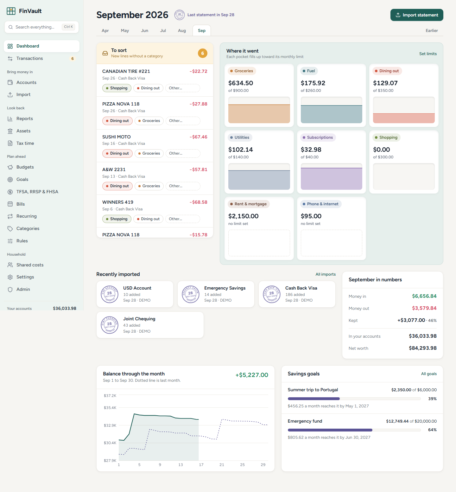
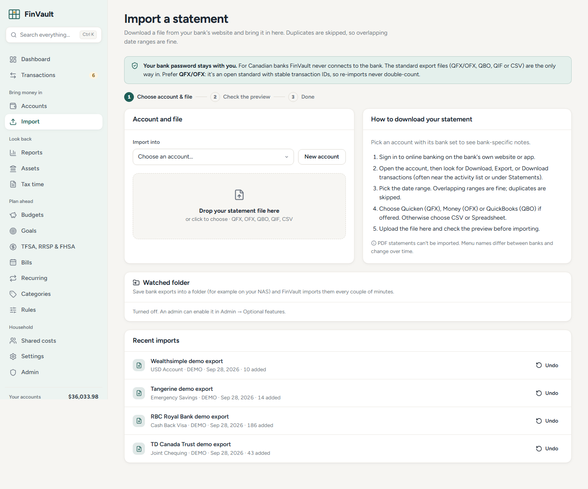
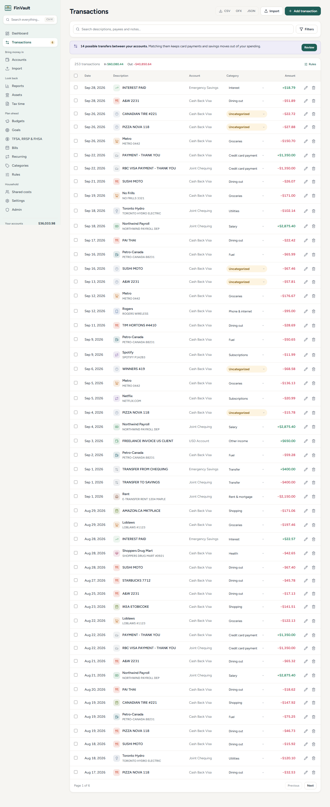
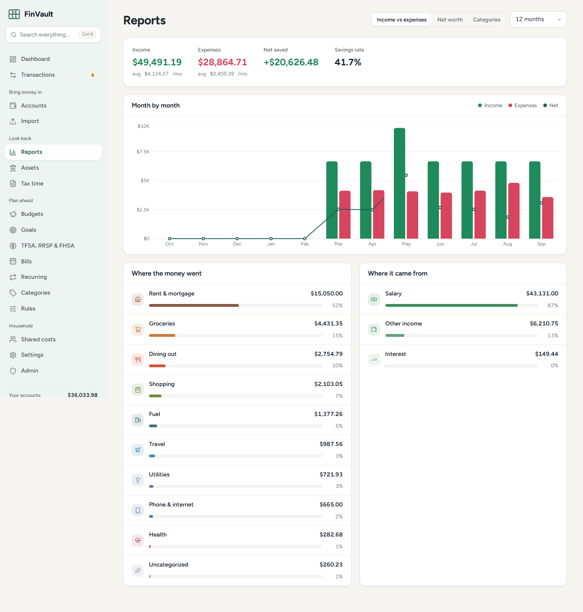

# FinVault

[](https://github.com/finvaultapp/finvault/actions/workflows/ci.yml)

Private household finance, sorted on your own hardware.

FinVault is a self-hosted personal finance app for households that want clean budgets, statement imports, shared-cost tracking, and reports without handing bank credentials or transaction history to a cloud company. It is file-first for Canadian banks: download the QFX/OFX/QBO/QIF/CSV export or text-based PDF statement your bank already provides, preview it, import it, and sort the new lines.



## Why It Exists

Most finance apps ask for too much trust. FinVault is built around a quieter bargain:

- Your accounts, transactions, receipts, reports, 2FA secrets, and provider tokens live in your own database.
- Canadian accounts never connect directly to a bank and never ask for an online-banking password.
- Optional features such as bank sync, OCR, notifications, exchange-rate fetching, and AI are off until an admin enables them.
- When exchange rates are missing, totals warn you instead of silently guessing.
- Each household member has a separate login and separate finance data.

## Product Tour

### Sort New Transactions

Imported lines without a category land in an amber tray. Rules and remembered merchants suggest where they belong, and the monthly pigeonhole wall shows where spending is going.


### Import Statements

FinVault handles OFX/QFX/QBO, QIF, CSV exports, and text-based PDF statements, including Canadian bank presets and a generic mapper for unusual files. Duplicates are skipped, overlapping date ranges are fine, and imports can be undone.



### Review Transactions

Search, filter, bulk edit, categorize, split, share, attach receipts, and export as CSV, OFX, or JSON.



### Understand Trends

Reports show income vs expenses, net worth, category breakdowns, budgets, goals, registered-plan reminders, tax summaries, and multi-currency warnings.



## Feature Highlights

- Multiple account types: chequing, savings, credit cards, cash, loans, investments, and assets.
- Statement imports for QFX/OFX/QBO, QIF, CSV, TXT, TSV, and text-based PDF.
- Built-in CSV presets for RBC, TD, CIBC, BMO, Scotiabank, Tangerine, Simplii, Wealthsimple, Rogers Bank, PC Financial, American Express Canada, and more.
- Categorization rules, remembered merchants, bulk editing, and one-click sorting.
- Budgets, recurring bills, bill reminders, goals, assets, debts, and net worth.
- TFSA, RRSP, and FHSA contribution-room tracking. Mark an account as a TFSA, FHSA or RRSP and its imported statements count toward that plan: every line is typed (contribution, withdrawal, transfer, RRSP-to-FHSA, growth, fee, trade), and next year's TFSA and FHSA room is estimated until you enter CRA's figure.
- Tax-time summaries for medical, child care, donations, moving, home office, and other deductible categories.
- Shared expenses, people balances, and settle-up tracking.
- Receipt attachments with optional local OCR through Tesseract.
- Multi-currency conversion with explicit missing-rate warnings.
- Canadian French interface and French default categories.
- Optional non-Canadian bank sync via GoCardless, Pluggy, or SimpleFIN.
- Optional AI chat over your own data, with a preview of exactly what will be sent before using it.
- Optional AI category suggestions for unfamiliar merchants and plain-language search ("restaurants over $50 last spring"), both off until you opt in.
- Investment holdings from Wealthsimple and Questrade exports, with optional price updates, gains, allocation, and ACB for non-registered accounts.
- Cash-flow forecast with low-balance warnings, a debt payoff planner (avalanche vs snowball, Canadian mortgage compounding), and price-change / new-subscription alerts.
- Year in review, ready to print.
- Automatic transfer matching, split transactions, and a watched import folder for NAS drops.
- Encrypted nightly backups to a folder or S3-compatible storage, single sign-on (OIDC), and an audit log.
- Installable phone app (PWA) with offline viewing that is wiped on sign-out.

## Canadian Banks

For Canadian accounts, FinVault is import-only by design. Canada does not yet have a live consumer open-banking system, and many aggregators fill that gap by asking for online-banking credentials. FinVault does not do that.

The flow is:

1. Sign in to your bank's website.
2. Download transactions as QFX, OFX, QBO, QIF, CSV, or a text-based PDF statement.
3. Upload the file in FinVault.
4. Review the preview, confirm column mapping if needed, and import.
5. Sort any uncategorized lines.

Canadian accounts are blocked from direct sync when the account country is CA, currency is CAD, or the provider institution looks Canadian.

### TFSA, FHSA and RRSP statements

Mark an account as a TFSA, FHSA or RRSP in its settings (FinVault suggests it from names like CELI, CELIAPP or REER; RRIFs stay plain accounts) and import its statements as usual: bank exports (OFX/QFX/QBO, QIF, CSV, PDF), the Wealthsimple monthly statement CSV, activity export and statement PDF, the Questrade activity export saved as CSV, or any brokerage CSV through the column mapper with a type column. Each line gets a type from the statement's own wording, in English or French, and you can change it in the preview or later. Each year gets a plan on the Registered accounts page; enter the room from CRA My Account and FinVault counts contributions against it and estimates next year's TFSA and FHSA room. The Wealthsimple and Questrade layouts are matched by column names and have not been checked against every real file, so look at the preview.

## Run With Docker

```bash
git clone https://github.com/finvaultapp/finvault.git
cd finvault
cp .env.example .env
docker compose up -d --build
```

Open [http://localhost:8000](http://localhost:8000). The first account you create becomes the admin. Data is stored in the `finvault-data` Docker volume.

Optional services:

```bash
docker compose --profile postgres up -d
docker compose --profile ai up -d
docker compose exec ollama ollama pull llama3.1
```

If you expose FinVault beyond a trusted LAN, put it behind HTTPS and set:

```env
COOKIE_SECURE=true
FORWARDED_ALLOW_IPS=<your reverse proxy IP or CIDR>
```

## Configuration

See [.env.example](.env.example) for the full list.

| Setting | Default | Purpose |
| --- | --- | --- |
| `REGISTRATION_MODE` | `invite` | Who can sign up after the admin: `open`, `invite`, or `closed`. |
| `DEFAULT_CURRENCY` | `CAD` | Suggested base currency for new members. |
| `COOKIE_SECURE` | `false` | Set to `true` behind HTTPS. |
| `FORWARDED_ALLOW_IPS` | Uvicorn default | Trust forwarded headers only from your reverse proxy. |
| `ALLOW_PRIVATE_OUTBOUND_URLS` | `false` | Allow user-configured webhook/provider URLs to call LAN hosts. |
| `BANK_SYNC_ENABLED` | `false` | Master switch for optional non-Canadian sync. |
| `SIMPLEFIN_ENABLED` | `false` | Allows SimpleFIN setup tokens. |
| `AI_ENABLED` | `false` | Enables the household AI endpoint. Members must still opt in. |
| `FX_FETCH_ENABLED` | `false` | Enables fetching ECB exchange rates. |
| `FOLDER_IMPORT_ENABLED` | `false` | Enables watched-folder imports. |
| `OCR_ENABLED` | `false` | Enables local receipt OCR. |
| `BACKUP_DIR` / `BACKUP_KEEP` | `/data/backups` / `14` | Where encrypted backups go and how many to keep (the passphrase is set in Admin). |
| `BACKUP_S3_*` | empty | Optional S3-compatible copy of each backup. |
| `OIDC_ENABLED` | `false` | Single sign-on; see below for the other `OIDC_*` settings. |
| `LOCAL_AUTH_ENABLED` | `true` | Set to `false` to allow only single sign-on. |
| `PUBLIC_URL` | empty | The address members open FinVault at. Needed (with SMTP) for "Forgot password?" emails. |
| `AUDIT_RETENTION_DAYS` | `365` | How long audit events are kept. |

## Backups

Everything is in the data volume. FinVault can also make **encrypted backups** for you (off by default):

1. In **Admin → Encrypted backups**, set a backup passphrase (at least 12 characters; write it down, it can't be recovered) and turn on **Nightly backup**. **Back up now** makes one right away.
2. Each backup is one `.fvbackup` file: a consistent database snapshot (SQLite's online backup API, or a JSON export of every table on Postgres), the receipts folder, `secret.key` and a manifest with a SHA-256 for every file, packed as tar.gz and encrypted with AES-256-GCM using a key derived from your passphrase with scrypt (random salt in the file header).
3. Files go to `BACKUP_DIR` (default `/data/backups`; mount your NAS share there) and, if the `BACKUP_S3_*` settings are filled in, also to S3-compatible storage. The newest `BACKUP_KEEP` (default 14) are kept in each place.

The passphrase is stored encrypted with the app's secret key and never sent back to the browser. If you set `SECRET_KEY` in `.env` instead of using the generated `/data/secret.key`, keep that value somewhere safe too: the backup only contains `secret.key`, and 2FA secrets and provider tokens are encrypted with the key.

#### Restoring a backup

The restore script checks everything before it overwrites anything, and refuses to run while FinVault has the database open.

```bash
docker compose stop finvault
# copy the backup into the data volume if it isn't there already
docker compose cp ./finvault-20260101-030000.fvbackup finvault:/data/backups/
# check the file and passphrase only (changes nothing)
docker compose run --rm finvault python -m scripts.restore_backup /data/backups/finvault-20260101-030000.fvbackup --verify-only
# restore (asks for the passphrase, then asks you to type "restore")
docker compose run --rm finvault python -m scripts.restore_backup /data/backups/finvault-20260101-030000.fvbackup
docker compose start finvault
```

Without Docker: `cd backend && .venv/Scripts/python -m scripts.restore_backup FILE --data-dir ../data` (use `.venv/bin` on macOS/Linux).

- The current database, receipts folder and `secret.key` are kept next to them as `*.before-restore-<time>` (for Postgres, take a `pg_dump` first: rows are replaced in one transaction).
- If FinVault crashed and left `finvault.db-wal` behind, the script thinks the database is still open. Make sure the server is stopped, then add `--force`.
- For scripted restores, set `FINVAULT_BACKUP_PASSPHRASE` instead of typing it. A SQLite backup restores into SQLite; a Postgres (JSON) backup restores into Postgres or SQLite.

## Single Sign-On (OIDC)

FinVault can sign people in with Authentik, Pocket ID, Keycloak or any standard OpenID Connect provider. Create a confidential client at the provider with the redirect URI `https://<your FinVault>/api/auth/oidc/callback`, then set `OIDC_ENABLED=true`, `OIDC_PROVIDER_NAME`, `OIDC_DISCOVERY_URL`, `OIDC_CLIENT_ID` and `OIDC_CLIENT_SECRET` in `.env`. The sign-in page then shows "Sign in with <provider>".

- It uses the authorization code flow with PKCE; state and nonce live in a short-lived signed cookie, and the ID token's signature (from the provider's JWKS), issuer, audience, expiry and nonce are all checked.
- With `OIDC_ALLOW_SIGNUP=false` (the default) only existing members can sign in, matched by the provider's **verified** email. The first sign-in links the provider account to the member, so later email changes at the provider can't take over another account. With `true`, new people get an account too, still following the registration mode (in invite mode, open the invite link first, then click the button).
- **Two-factor:** when a member who has FinVault TOTP turned on signs in through the provider, FinVault doesn't ask for their code again. The provider is trusted to do its own multi-factor check, so turn on MFA there. Password sign-in still asks for the code.
- `LOCAL_AUTH_ENABLED=false` hides the password form and refuses password sign-in and registration. Keep at least one admin who can sign in through the provider before turning it off.

## Audit Log

**Admin → Audit log** lists security events: sign-ins and failed sign-ins (email and IP address, never passwords), 2FA on/off/reset, password changes, sign out everywhere, admin setting changes (which keys, never secret values), members created/deleted/changed, invites, backups, bank sync connect/disconnect and AI keys added/removed. Filter by event or member and export to CSV. Events older than `AUDIT_RETENTION_DAYS` (default 365) are deleted nightly. Behind a reverse proxy, the IP is taken from `X-Forwarded-For` (the Docker image runs uvicorn with `--proxy-headers`), so don't expose the container port directly if you rely on it.

## Security Notes

- Passwords are bcrypt-hashed after SHA-256 prehashing, so long passphrases keep their entropy.
- Sessions are HttpOnly, SameSite cookies; cookie-authenticated writes require the `X-FinVault` header.
- Login throttling applies both per apparent IP/email pair and per email.
- TOTP secrets, provider tokens, and AI keys are encrypted at rest.
- Security headers include no-sniff, frame denial, referrer policy, permissions policy, and CSP for the SPA.
- Uploaded receipts are sniffed by file bytes, stored under random names, and capped at 10 MB.
- Statement imports are capped at 15 MB before parsing.
- PDF statement import is best-effort and works only when the statement contains selectable text. Prefer QFX/OFX or CSV when available.
- User-configured outbound URLs are guarded against localhost/private-network SSRF by default.
- Alembic migrations run at startup, with a compatibility path for older local databases.

## Development

Backend:

```bash
cd backend
python -m venv .venv
.venv/Scripts/pip install -r requirements-dev.txt
.venv/Scripts/python -m pytest
.venv/Scripts/python -m scripts.demo_seed
.venv/Scripts/python -m uvicorn app.main:app --reload
```

Frontend:

```bash
cd frontend
npm install
npm run dev
npm run build
npm audit --omit=dev
```

The Vite dev server proxies `/api` to `localhost:8000`. API docs are available at `/api/docs` while the backend is running.

## Screenshots

The screenshots in `docs/screenshots` are generated from the synthetic demo household.

```bash
cd frontend
npm run build
# In another terminal, run the backend with demo data on http://127.0.0.1:8765
npm run screenshots
```

Demo credentials:

```text
demo@finvault.local
demo-password-123
```

All demo transactions and balances are fake.

## CI

GitHub Actions (`.github/workflows/ci.yml`) runs on every push: backend tests, the frontend build and a production dependency audit, Playwright browser tests against the built app with demo data, and a Docker image build with a health-check smoke test.

## Running the tests

```bash
cd backend && python -m pytest -q          # API and importer tests

cd frontend
npm run build                              # the browser tests use the built app
npx playwright install chromium            # once
npm run test:e2e                           # Playwright, Chromium only
```

`npm run test:e2e` seeds a demo household into a temporary data folder and starts `backend/scripts/serve_local.py` on port 8765 (`E2E_PORT` to change it, `PYTHON` to pick the interpreter with the backend requirements). To test a server that is already running, set `E2E_BASE_URL` instead. CI (`.github/workflows/ci.yml`) runs the backend tests, the frontend build, the browser tests and a Docker build with a health-check smoke test.

## Credits

FinVault's interface takes inspiration from soft household sorting rooms and statement envelopes. Earlier visual exploration referenced [Securo](https://github.com/securo-finance/securo), but no Securo code is included.
